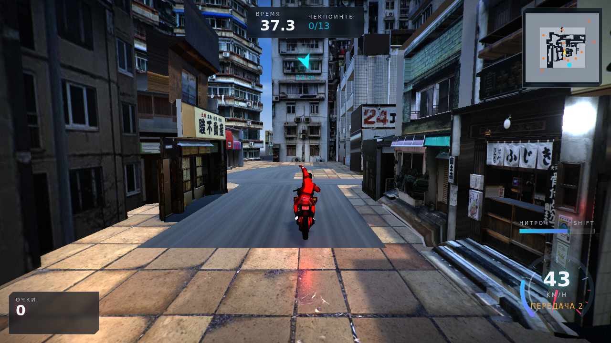
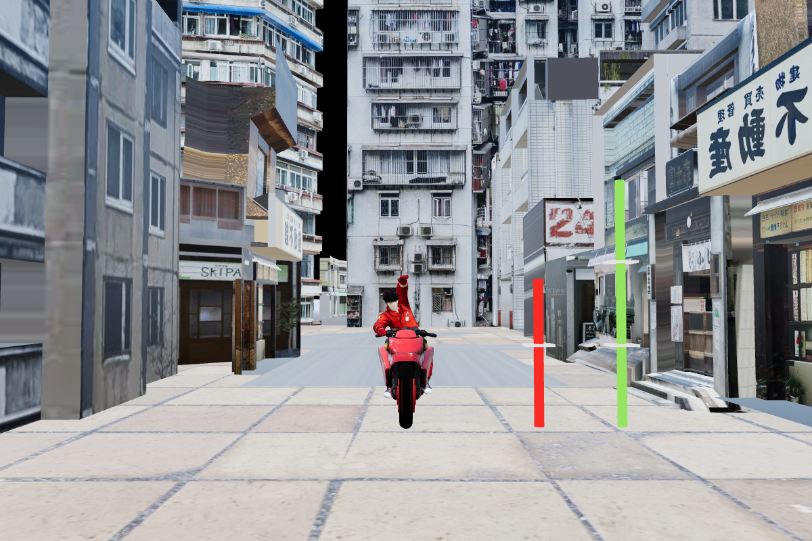

# Neo Street Rider

Гонка на мотоцикле от третьего лица (вид как в GTA) по японской улице.
Локация — модель как есть: текстуры и материалы из исходника не тронуты.
Three.js, без движка, всё считается в браузере.



Масштаб выверен по самой модели: рост сидящего ездока 1.76 м, отметки на
линейках — 1.8 м и 3 м.



## Как запустить

**Вариант 1 — один файл.** `npm run build:single` соберёт
`neo-street-rider.html` (~15 МБ): бандл и обе модели зашиты внутрь в base64,
открывается двойным кликом с диска, без сервера и без интернета.

**Вариант 2 — локальный сервер.**

```bash
npm install
npm run build      # собирает game.js и папку dist/
npm run serve      # http://127.0.0.1:8123
```

## Управление

| Клавиши | Действие |
| --- | --- |
| `W` / `S` | газ / тормоз; удержать `S` на месте — задний ход |
| `A` / `D` | поворот |
| `Space` | ручник — вход в дрифт |
| `Shift` | нитро |
| `ПКМ` + мышь | свободный обзор, `колесо` — отдалить камеру |
| `Q` / `E` | взгляд вбок, `B` — назад |
| `C` | смена камеры (погоня / ближе / от первого лица / кино) |
| `R` | респаун на маршруте |
| `P` · `Esc` | пауза, `F2` — качество, `F3` — счётчик кадров |

Геймпад (стандартный маппинг, RT/LT — газ и тормоз, вибрация при ударе) и
сенсорные кнопки на телефоне работают тоже.

В меню **Управление** настраиваются чувствительность и скорость руля,
помощь в управлении, автоконтрруль в дрифте, мышь, дистанция камеры и
тряска. Всё пишется в `localStorage`.

## Режимы

- **Заезд на время** — 13 ворот: из переулка в тупик и обратно, восточный
  карман, северная полоса, западная прямая. Каждые ворота добавляют 7 секунд.
- **Свободная езда** — улица без таймера.

Очки капают за дрифт с множителем за длину заноса и за полёты.

## Что внутри

```
src/
  config.js            все настройки управления и мира в одной таблице
  settings.js          пользовательские настройки + localStorage
  input.js             клавиатура, мышь, геймпад, тач в одном состоянии
  engine/
    renderer.js        WebGL2, EffectComposer, 3 профиля качества
    collision.js       два BVH (пол / стены) из запечённых треугольников сцены
    assets.js          загрузка GLB: по сети, base64-скриптами или инлайном
  world/
    world.js           сборка сцены + карта проезжаемых мест
    hero.js            модель улицы как есть: только тени и фильтрация текстур
    sky.js             дневное небо, солнце, облака, PMREM-окружение
    checkpoints.js     ворота и маршрут по реальной геометрии улицы
    textures.js        асфальт площадки рисуется в canvas
  bike/
    bike.js            физика мотоцикла и риг модели
    chasecam.js        камера погони с пружиной и защитой от стен
  fx/                  следы шин, дым, искры, финальный шейдер
  audio/audio.js       звук движка целиком синтезируется (WebAudio)
  ui/                  HUD (спидометр, миникарта) и меню
  game.js              правила: ворота, таймер, очки, рекорды
```

### Масштаб

Модель улицы нарисована примерно в 0.62 натуральной величины — по её же
фото-текстурам этаж дома выходил 1.65 м вместо реальных 2.7. Байк наоборот
был крупнее реального: 3.33 м в длину. Поэтому улица увеличена в 1.6 раза,
а мотоцикл уменьшен в 0.8 — теперь этаж 2.64 м, переулок 7.2 м шириной,
мотоцикл 2.66 м длиной и 0.76 м шириной, голова ездока на 1.76 м. Все
размеры в игре — метры, скорости — настоящие км/ч.

Два материала улицы (`дом3.001` и `c83d8…`) потеряли текстуру ещё при
конвертации FBX и светились жёлтым — им возвращена текстура их же
материала-близнеца. Больше в материалах не меняется ничего, кроме теней,
анизотропной фильтрации и двусторонней отрисовки фасадов; плитке возвращена
исходная плотность тайлинга после увеличения улицы.

### Физика

Сцепление 1.2 g, поэтому наклон в повороте считается как в жизни —
`atan(a_поперечное / g)` — и доходит до 51°, а радиус растёт с квадратом
скорости: 31 м на 70 км/ч, 90 м на 113 км/ч. Перед поворотом реально надо
тормозить.

Скорость живёт в мировых координатах, а корпус вращается отдельно. Когда
байк доворачивает, скорость **переводится** в новый базис точным поворотом —
продольная перетекает в поперечную. Это и есть занос, и энергия при этом не
берётся из воздуха: гасит её только сцепление шин. Поворот ограничен
сцеплением (`ω = a_поперечное / v`), поэтому на 140 км/ч радиус большой и
перед поворотом надо тормозить.

Помощь в управлении (включена по умолчанию) ловит незапланированный занос,
автоконтрруль держит дрифт под ровным углом. Обе выключаются в меню.

Замеры (headless Chromium, `tools/`):

| | |
| --- | --- |
| 0–100 км/ч | 3.0 с |
| максималка | 158 км/ч (198 с нитро) |
| наклон в повороте | до 51° |
| радиус на 69 / 113 км/ч | 33 / 90 м |
| дрифт | держится 6 с на 120–157 км/ч, угол 21–33° |
| вилли | до 17° |
| физика | 0.055 мс/кадр |

Трасса проверяется ботом, который едет по маршруту из карты проездов:
связность всех 13 ворот по земле + проезд 13/13 за 65 с.

### Коллизии

Все треугольники сцены (~69 000) запекаются в мировые координаты один раз и
делятся по нормали на два BVH: «пол» опрашивается лучом вниз от уровня чуть
выше колёс (иначе байк запрыгивает на крыши), «стены» — сферой, которая
выталкивает только по горизонтали. Сфера поднята выше бордюров, поэтому на
тротуар заехать можно, а в стену — нет.

### Карта проезжаемых мест

На старте сцена сканируется сеткой 1.5 м: под каждой точкой ищется пол и
проверяется, помещается ли байк. Полученная маска даёт миникарту, точки
респауна и расстановку ворот — ворота сами подстраивают ширину под проём,
поэтому в переулке они узкие, а на открытой площадке широкие.

## Ассеты

- `assets/rider.glb` — Akira guy on motorcycle (анимация 8.3 с), FBX → GLB,
  текстуры пережаты в WebP: 28 МБ → 5.6 МБ.
- `assets/street.glb` — японская улица, FBX → GLB через FBX2glTF,
  13.7 МБ → 5.8 МБ.

Обе модели предоставлены пользователем. Материалы улицы в игре не
переопределяются: включаются только тени и анизотропная фильтрация.
Конвейер конвертации описан в `tools/README.md`.
