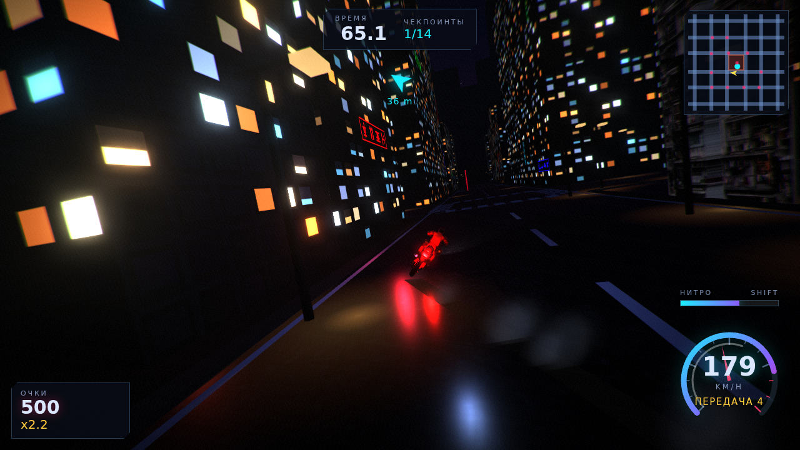

# Neo Street Rider

Гонка на мотоцикле от третьего лица (вид как в GTA) по ночному Нео-Токио.
Three.js, без движка, всё в браузере.



## Как запустить

**Вариант 1 — один файл.** `npm run build:single` соберёт
`neo-street-rider.html` (~15 МБ): бандл и обе модели зашиты внутрь в base64,
открывается двойным кликом с диска, без сервера и без интернета.

**Вариант 2 — локальный сервер.**

```bash
npm install
npm run build      # собирает game.js и папку dist/
npm run serve      # http://127.0.0.1:8123
```

## Управление

| Клавиши | Действие |
| --- | --- |
| `W` / `S` | газ / тормоз (и задний ход) |
| `A` / `D` | поворот |
| `Space` | ручник — вход в дрифт |
| `Shift` | нитро |
| `C` | смена камеры (погоня / ближе / от первого лица / кино) |
| `B` | взгляд назад |
| `R` | респаун на маршруте |
| `P` · `Esc` | пауза |
| `F2` | качество графики |

Геймпад (стандартный маппинг) и сенсорные кнопки на телефоне тоже работают.

## Режимы

- **Заезд на время** — 14 неоновых ворот по кольцу города и через японский
  переулок; каждые ворота добавляют 11 секунд. Очки за дрифт с множителем.
- **Свободная езда** — город без таймера.

Рекорды пишутся в `localStorage`.

## Что внутри

```
src/
  config.js            все настройки управления и мира в одной таблице
  engine/
    renderer.js        WebGL2, EffectComposer, bloom, 3 профиля качества
    collision.js       два BVH (пол / стены) из запечённых треугольников сцены
    assets.js          загрузка GLB: по сети, base64-скриптами или инлайном
  world/
    world.js           сборка сцены и коллизий
    city.js            процедурный город: кварталы, дороги, разметка, неон
    hero.js            японская улица из ассета, подсветка витрин, фонарики
    textures.js        все текстуры рисуются в canvas на лету
    sky.js             градиентное небо, луна, звёзды, PMREM-окружение
    checkpoints.js     неоновые ворота и генерация маршрута
  bike/
    bike.js            физика мотоцикла и риг модели
    chasecam.js        камера погони с пружиной и защитой от стен
  fx/                  следы шин, дым, искры, финальный шейдер
  audio/audio.js       звук движка целиком синтезируется (WebAudio)
  ui/                  HUD (спидометр, миникарта) и меню
  game.js              правила: чекпоинты, таймер, очки, рекорды
```

### Физика

Мотоцикл не «едет по рельсам»: скорость живёт в мировых координатах, а
корпус вращается отдельно — из-за этого сам собой появляется угол
скольжения, а дрифт получается настоящим. Поворот ограничен сцеплением
(`ω = a_поперечное / v`), поэтому на 180 км/ч радиус большой и перед
поворотом надо тормозить.

Замеры (`tools/` + headless Chromium):

| | |
| --- | --- |
| 0–100 км/ч | 2.98 с |
| максималка | 184 км/ч (227 с нитро) |
| торможение 100–0 | 25.6 м |
| радиус на 88 км/ч | 34 м |
| физика | 0.055 мс/кадр |

### Коллизии

Все треугольники сцены (~98 000) запекаются в мировые координаты один раз и
делятся по нормали на два BVH: «пол» опрашивается лучом вниз, «стены» —
сферой, которая выталкивает только по горизонтали (иначе байк заезжает на
крыши). Сфера поднята выше бордюров, поэтому на тротуар можно заехать, а в
стену — нет.

## Ассеты

- `assets/rider.glb` — Akira guy on motorcycle (анимация 8.3 с), FBX → GLB,
  текстуры пережаты в WebP: 28 МБ → 5.6 МБ.
- `assets/street.glb` — японская улица, FBX → GLB через FBX2glTF,
  13.7 МБ → 5.8 МБ.

Обе модели предоставлены пользователем; конвейер описан в `tools/README.md`.
